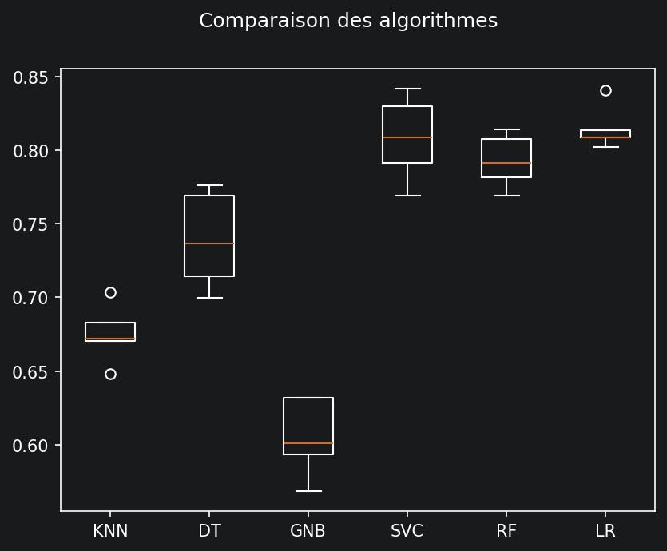
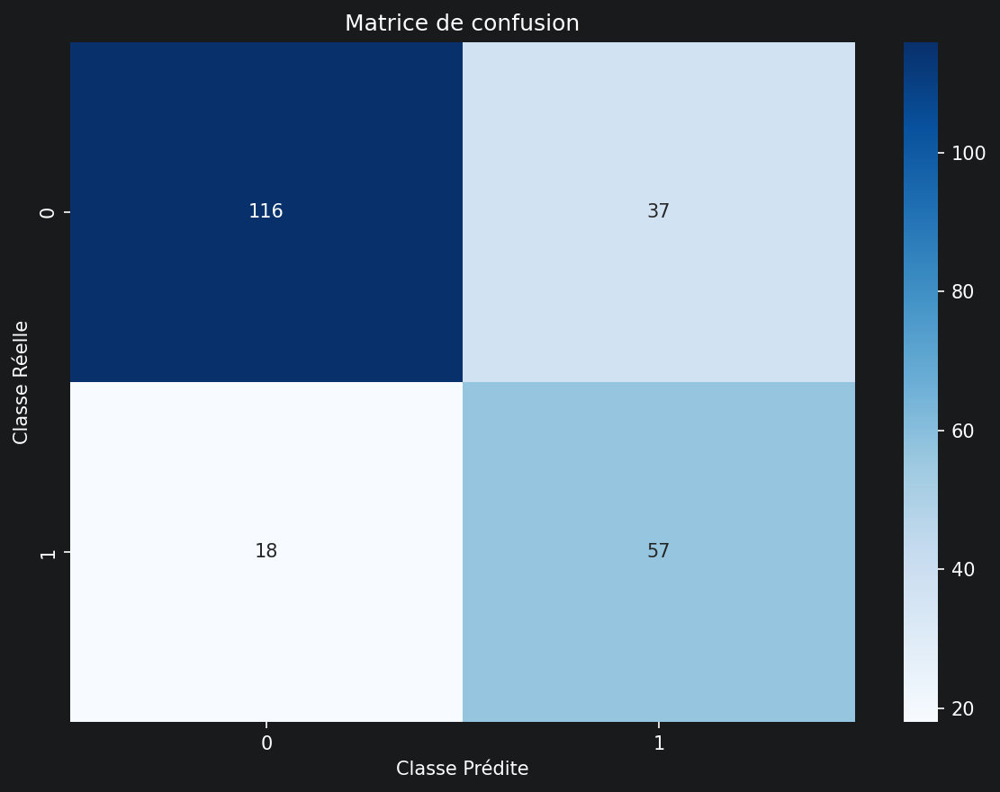

# Classification de tweets scientifiques sur Twitter/X

Projet réalisé dans le cadre du cours HAI817 (Machine Learning) à l'Université de Montpellier. 
Pipeline qui classe des tweets selon leur rapport à la science : scientifique ou non, affirmation, référence ou contexte. Entraîné et évalué sur le dataset [SciTweets](https://dl.acm.org/doi/10.1145/3511808.3557687) (Hafid et al., 2022, CIKM).

Lien pour ouvrir le notebook sur votre navigateur : [](https://mybinder.org/v2/gh/phanpyyy/classification-tweets/main)
<br>Notebook présent dans notebooks/main.ipynb puis run all et regarder la partie Main (choix de la tâche puis du classifieur...)

---

## Stack
 
Python · scikit-learn · imbalanced-learn · spaCy · Optuna · pandas

---

## Fonctionnalités

- Nettoyage (URLs, hashtags, emojis, mentions, ponctuations) et vectorisation (TF-IDF) des tweets bruts
- Comparaison de 6 classifieurs (KNN, arbre de décision DT, Naive Bayes GNB, SVC, Random Forest RF, régression logistique LR) sur 3 tâches de classification
- Gestion du déséquilibre des classes avec SMOTE, upsampling, downsampling ou pondération des classes/class weight
- Optimisation des hyperparamètres du meilleur modèle avec Optuna
- Récupération des features les plus discriminantes selon le type de modèle

---

## Structure du projet

```
.
├── data/
│   └── scitweets_export.tsv     # Dataset
├── notebooks/
│   └── main.ipynb               # Code principal
├── pipelines/                   # Modèles entraînés (.joblib)          
├── images/                      # Graphiques et visualisations pour le README
└── requirements.txt
```
---

## Utilisation

Le notebook est organisé en 8 sections à exécuter dans l'ordre :

1. Configuration - import des librairies et chargement des données
2. Nettoyage des données - nettoyage du texte + split train/test
3. Création des classifieurs
4. Construction du pipeline (TF-IDF -> rééquilibrage -> classifieur)
5. Visualisation
6. Comparaison des classifieurs et optimisation des hyperparamètres du modèle choisi
7. Main
8. Recherche des meilleurs features

---

## Résultats

### Performance globale

| Tâche | Meilleur modèle | Accuracy | F1 (macro) |
|---|---|---|---|
| SCI vs NON-SCI | RF | 0.76 | 0.74 |
| Affirmation/Référence vs Contexte | RF | 0.87 | 0.61 |
| Affirmation vs Référence vs Contexte | SVC | 0.75 | 0.63 |


### Visualisations SCI vs NON-SCI
<table>
  <tr>
    <td width="50%">
      
    </td>
    <td width="50%">
      
    </td>
  </tr>
</table>

### Top features — SCI vs NON-SCI

| feature           |     score |
|:------------------|----------:|
| url               | 0.0900444 |
| stop              | 0.0832922 |
| support           | 0.0585473 |
| study             | 0.049211  |
| health            | 0.0399762 |
| EMOJI             | 0.0354282 |
| brain             | 0.0306916 |
| report            | 0.0270199 |
| url url           | 0.0262267 |
| research          | 0.021595  |
| hashtag_eurekamag | 0.0208788 |
| virus             | 0.0183832 |
| reduce            | 0.0172745 |
| help              | 0.0169644 |
| risk              | 0.0166775 |
| cancer            | 0.0154245 |
| EMOJI EMOJI       | 0.0143331 |
| need              | 0.0125729 |
| increase          | 0.011669  |
| find              | 0.0114661 |

